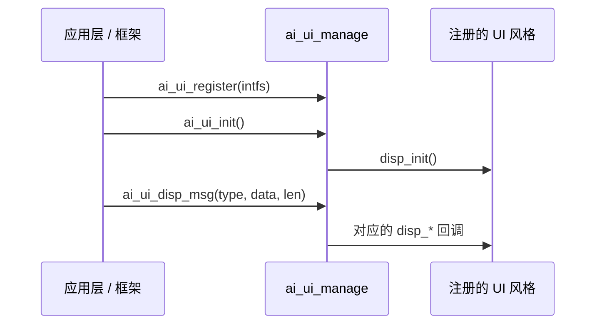

`ai_ui_manage` 是 TuyaOpen AI 框架的屏幕聊天 UI 调度层。框架把聊天消息交给它——用户文本、AI 回复、情绪、状态、通知、网络状态、摄像头画面、图片——它再把每条消息路由到当前注册的 UI 风格。固件的其余部分无需直接绘制屏幕，只需发送一条带类型的消息，由注册的风格负责渲染。

它位于框架（产生消息）与具体 UI 风格（绘制消息）之间。三种内置风格——[微信风格](ai-ui-chat-wechat)、[Chatbot](ai-ui-chat-chatbot)、[OLED](ai-ui-chat-oled)——各自注册自己的实现。自定义 UI 实现同一套接口即可。

## 工作原理

你注册一个 `AI_UI_INTFS_T`（一组显示回调），再调用 `ai_ui_init()`。此后每次 `ai_ui_disp_msg()` 调用都会入队，并在 UI 线程上分发给对应回调，因此调用方不会阻塞在渲染上。



## UI 接口

UI 风格实现 `AI_UI_INTFS_T`，即 `ai_ui_manage` 调用的契约。风格不处理的消息可将对应回调置为 `NULL`。框架分发对应消息时，相应回调被触发。

| 回调 | 触发时机 |
|------|----------|
| `disp_init` | UI 模块初始化时。用于初始化显示设备与屏幕布局。返回 `OPERATE_RET`。 |
| `disp_user_msg` | 显示用户消息（识别出的语音或输入的文本）。 |
| `disp_ai_msg` | 一次性显示完整的 AI 回复。 |
| `disp_ai_msg_stream_start` | AI 回复开始流式显示。创建消息容器。 |
| `disp_ai_msg_stream_data` | 收到一段流式 AI 文本。追加显示。 |
| `disp_ai_msg_stream_end` | 流式 AI 回复结束。 |
| `disp_system_msg` | 显示系统消息。 |
| `disp_emotion` | AI 表达情绪。字符串为情绪名称。 |
| `disp_ai_mode_state` | AI 模式状态变化（如聆听、思考）。 |
| `disp_notification` | 显示通知。 |
| `disp_wifi_state` | 网络状态变化。参数为 `AI_UI_WIFI_STATUS_E`。 |
| `disp_ai_chat_mode` | 当前对话模式变化。 |
| `disp_other_msg` | 收到自定义 `type` 的消息，携带原始 `data`/`len` 负载。 |
| `disp_camera_start` | 摄像头预览开始。参数为帧 `width` 与 `height`。返回 `OPERATE_RET`。 |
| `disp_camera_flush` | 一帧摄像头画面待绘制。返回 `OPERATE_RET`。 |
| `disp_camera_end` | 摄像头预览结束。返回 `OPERATE_RET`。 |
| `disp_picture` | 显示图片。受 `ENABLE_COMP_AI_PICTURE` 控制。返回 `OPERATE_RET`。 |

## 消息类型

`ai_ui_disp_msg()` 接收一个 `AI_UI_DISP_TYPE_E`，用于选择执行哪个回调：

```c
typedef enum {
    AI_UI_DISP_USER_MSG,                 // 用户消息
    AI_UI_DISP_AI_MSG,                   // 完整 AI 消息
    AI_UI_DISP_AI_MSG_STREAM_START,      // AI 消息流开始
    AI_UI_DISP_AI_MSG_STREAM_DATA,       // AI 消息流数据
    AI_UI_DISP_AI_MSG_STREAM_END,        // AI 消息流结束
    AI_UI_DISP_AI_MSG_STREAM_INTERRUPT,  // AI 消息流中断
    AI_UI_DISP_SYSTEM_MSG,               // 系统消息
    AI_UI_DISP_EMOTION,                  // 情绪
    AI_UI_DISP_STATUS,                   // AI 模式状态
    AI_UI_DISP_NOTIFICATION,             // 通知
    AI_UI_DISP_NETWORK,                  // 网络状态
    AI_UI_DISP_CHAT_MODE,                // 对话模式
    AI_UI_DISP_SYS_MAX,
} AI_UI_DISP_TYPE_E;
```

网络状态用 `AI_UI_WIFI_STATUS_E` 表示：

```c
typedef uint8_t AI_UI_WIFI_STATUS_E;
#define AI_UI_WIFI_STATUS_DISCONNECTED 0  // 未连接
#define AI_UI_WIFI_STATUS_GOOD         1  // 信号良好
#define AI_UI_WIFI_STATUS_FAIR         2  // 信号正常
#define AI_UI_WIFI_STATUS_WEAK         3  // 信号弱
```

## 接口参考

头文件：`ai_ui_manage.h`。所有函数返回 `OPERATE_RET`（成功时为 `OPRT_OK`）。

```c
OPERATE_RET ai_ui_register(AI_UI_INTFS_T *intfs);
OPERATE_RET ai_ui_init(void);
OPERATE_RET ai_ui_disp_msg(AI_UI_DISP_TYPE_E tp, uint8_t *data, int len);
OPERATE_RET ai_ui_camera_start(uint16_t width, uint16_t height);
OPERATE_RET ai_ui_camera_flush(uint8_t *data, uint16_t width, uint16_t height);
OPERATE_RET ai_ui_camera_end(void);
OPERATE_RET ai_ui_disp_picture(TUYA_FRAME_FMT_E fmt, uint16_t width, uint16_t height,
                               uint8_t *data, uint32_t len);  // ENABLE_COMP_AI_PICTURE
```

| 函数 | 参数 | 作用 |
|------|------|------|
| `ai_ui_register` | `intfs`——风格的 `AI_UI_INTFS_T` | 注册某个 UI 风格的显示回调。 |
| `ai_ui_init` | — | 初始化 UI 模块，并调用已注册的 `disp_init`。 |
| `ai_ui_disp_msg` | `tp`、`data`、`len`——消息类型、负载、长度 | 把一条带类型的消息入队，交给已注册风格渲染。 |
| `ai_ui_camera_start` | `width`、`height`——帧尺寸 | 启动摄像头预览。 |
| `ai_ui_camera_flush` | `data`、`width`、`height`——帧缓冲与尺寸 | 绘制一帧摄像头画面。 |
| `ai_ui_camera_end` | — | 结束摄像头预览。 |
| `ai_ui_disp_picture` | `fmt`、`width`、`height`、`data`、`len` | 显示图片。打开 `ENABLE_COMP_AI_PICTURE` 后可用。 |

:::note
请在调用 `ai_ui_init()` **之前**注册风格——初始化会运行风格的 `disp_init` 回调。每种内置风格都提供一个注册函数（例如 `ai_ui_chat_wechat_register()`），它会替你调用 `ai_ui_register`。
:::

## 注册一种 UI 风格

选择一种内置风格的注册函数，再初始化模块：

```c
#include "ai_ui_manage.h"
#include "ai_ui_chat_wechat.h"

OPERATE_RET ui_start(void)
{
    OPERATE_RET rt = OPRT_OK;

    // 注册一种 UI 风格（WeChat、Chatbot 或 OLED）。
    TUYA_CALL_ERR_RETURN(ai_ui_chat_wechat_register());

    // 初始化 UI 模块——运行风格的 disp_init 回调。
    TUYA_CALL_ERR_RETURN(ai_ui_init());

    return rt;
}
```

要构建自定义 UI，填写自己的 `AI_UI_INTFS_T` 并直接注册：

```c
static OPERATE_RET my_disp_init(void) { /* 初始化屏幕 */ return OPRT_OK; }
static void my_disp_user_msg(char *string) { /* 绘制用户消息 */ }
static void my_disp_ai_msg(char *string)   { /* 绘制 AI 回复 */ }

OPERATE_RET my_ui_register(void)
{
    static AI_UI_INTFS_T intfs = {
        .disp_init     = my_disp_init,
        .disp_user_msg = my_disp_user_msg,
        .disp_ai_msg   = my_disp_ai_msg,
        // 未处理的回调保持 NULL
    };
    return ai_ui_register(&intfs);
}
```

## 相关文档

- [微信风格 UI](ai-ui-chat-wechat)——适用于彩色 LCD 的气泡聊天
- [Chatbot UI](ai-ui-chat-chatbot)——居中的单条消息显示
- [OLED UI](ai-ui-chat-oled)——适用于小尺寸单色屏
- [AI Agent](ai-agent)——产生消息的云端桥梁
- [组件框架](ai-components.md)——`ai_ui` 在整个 AI 框架中的位置
