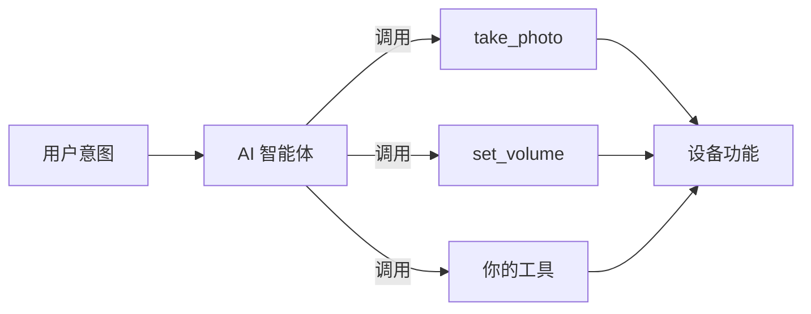
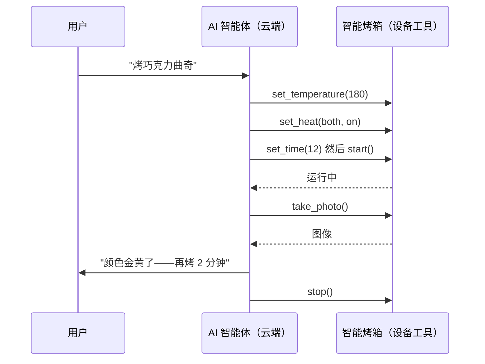

一个 **设备 MCP 工具** 封装了设备的某项功能——读取传感器、修改设置、驱动电机、拍一张照片——以便设备端的 AI 智能体能够调用它。工具正是让一台智能体设备把自身能力转化为 AI 真正可用之物的途径。本文讲的是设计优秀工具背后的思路；关于 API，请参见 [MCP Server](../ai-components/ai-mcp-server)。

## 为什么用工具，而非命令

在一台 App 优先的设备上，你编写的是流程：按键 → 处理函数 → 动作。而在一台智能体设备上，你转而发布一份 **能力清单**，让智能体根据对话来决定调用哪些能力、按什么顺序调用。你发布的每一项能力就是一个工具。

智能体读取每个工具的 **名称和描述** 来决定何时调用它。这意味着你的工具定义不只是底层管道——它们是 AI 所依赖的指令。要为模型阅读而编写它们。

## 什么样的工具才算好

### 按意图命名，而非按实现命名

名称和描述应当描述 *用户得到了什么*，而不是固件是怎么做的。`set_room_temperature` 比 `pwm_write_channel_3` 要好。智能体会把用户意图与该描述相匹配，因此含糊或内部化的名称会导致调用错误的工具——或者一个都不调。

### 一个工具，只做一件事

一个做好几件事的工具，会让智能体难以正确选择。把「管理灯光」拆分成 `set_brightness`、`set_color` 和 `turn_off`。小而单一用途的工具可以组合；多用途的工具只会带来混乱。

### 精确描述参数

每个参数（即一个 MCP *property*）都需要一个类型，并在适用时给出取值范围。`volume` 是 `0–100` 的整数；`mode` 取自一组固定值。精确的边界让智能体能够提供合法的参数，也让你的回调函数能够信任它的输入。TuyaOpen 的 property 支持带类型的默认值和取值范围——参见 [MCP Server](../ai-components/ai-mcp-server) 中的 `ai_mcp_property_set_range` 和 `set_default_*` 系列辅助函数。

### 返回结构化、有意义的结果

工具应当报告发生了什么，好让智能体能据此表述：新的温度、它拍到的照片、「已关闭」。返回带类型的值（bool、int、string、JSON 或一张图像），而不只是成功/失败。智能体会把你的返回值转化成它的回复。

### 让工具默认就安全

智能体会以你未曾预料的组合方式调用工具。要保护设备：

- **在回调内部做校验**，即便 property 是带类型的——绝不盲目信任某个值。
- **尽可能让操作具备幂等性**，这样重复调用也无害。
- **为危险操作设关卡。** 破坏性或不可逆的操作（恢复出厂设置、解锁）应当有一个确认步骤，而不是一个赤裸裸的工具。
- **遵循最小权限原则。** 只发布产品确实需要 AI 触及的工具。

## 实例：智能烤箱

智能烤箱是"暴露能力，而非流程"的典型例子。烤箱只有少数几个物理功能；把每个功能封装成工具，智能体就能根据一句口述的菜谱来烹饪——这是固定菜单永远做不到的。

### 把烤箱功能封装为工具

| 工具 | 属性 | 返回 | 对应 |
|------|------|------|------|
| `set_temperature` | `celsius`（int，0–250） | 新设定值 | 加热控制 |
| `set_time` | `minutes`（int，0–180） | 定时值 | 倒计时 |
| `set_heat` | `element`（`top` / `bottom` / `both`）、`on`（bool） | 发热管状态 | 上/下发热管 |
| `start` | — | 运行状态 | 开始加热 |
| `stop` | — | 停止状态 | 结束加热 |
| `take_photo` | — | JPEG 图像 | 内置摄像头 |

每个工具都以意图命名、职责单一、属性带类型与范围、返回有意义的结果——正好符合上面的规则。范围很关键：把 `celsius` 上限设为 250，意味着智能体在物理上无法请求一个不安全的温度。

### 让智能体规划菜谱

因为烤箱发布的是能力而不是固定的"烘焙"按钮，智能体会把一句开放式请求转化为计划，并按顺序调用工具——包括用摄像头*检查熟度*，再决定是否继续。

菜谱知识（"曲奇 180°C 烤约 12 分钟""边缘金黄即熟"）存在于云端智能体的推理与技能中。设备只需暴露诚实、安全的工具。换一道菜谱，设备侧无需任何改动——这正是面向智能体的回报。

:::tip
这正是[设备与云端协作](/device-cloud)页面演示的交互——在那里试用交互式菜谱演示，看看哪些步骤在设备上运行、哪些在云端运行。
:::

## 向内置工具学习

TuyaOpen 自带一小组设备工具作为参考实现——查询设备信息、拍照、设置音量、切换对话模式。它们恰恰遵循这些规则：以意图命名、单一用途、带取值范围的带类型 property、结构化返回，并且每一个都由它所触及的组件来设防。在编写你自己的工具之前，先在 [内置 MCP 工具](../ai-components/ai-mcp-tools) 中研究它们。

## 设备工具 vs 云端 MCP

MCP 存在两个层级，它们解决的是不同的问题：

| | 设备 MCP 工具 | 云端 MCP |
|---|------------------|------------------|
| 运行在 | 设备上 | 涂鸦云端智能体上 |
| 触及 | 本地传感器、执行器、外设 | 外部服务、API、数据库 |
| 定义方式 | [`ai_mcp` 服务端 API](../ai-components/ai-mcp-server) | [云端 MCP 管理](../../tuya-cloud/ai-agent/mcp-management) |

一个完整的产品往往两者都用：设备工具负责「这个盒子能感知和能做什么」，云端 MCP 负责「外部世界能为它做什么」。

## 参见

- [MCP Server](../ai-components/ai-mcp-server)——设备端的工具 API
- [内置 MCP 工具](../ai-components/ai-mcp-tools)——参考实现
- [面向智能体的硬件](agentic-first-hardware)——为什么能力胜过流程
- [管理云端 MCP](../../tuya-cloud/ai-agent/mcp-management)——其云端侧的对应物
