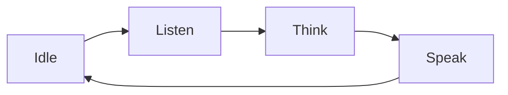

语音优先设计意味着 **对话是用户控制设备的主要方式**——由语音承载交互，而屏幕、LED 和提示音则起辅助作用，而非主导作用。本文介绍让语音交互显得自然的若干原则，以及每条原则如何对应到一项 TuyaOpen 能力。

## 为什么要语音优先

语音是硬件中摩擦最低的交互界面：它不需要屏幕、不需要 App，也无需学习。它支持解放双手，并能隔着房间使用。但语音也很不留情——没有菜单可供浏览，因此设备必须显得反应灵敏、让自身状态一目了然，并在听错时优雅地恢复。好的语音设计，主要就是在管理这些预期。

## 原则

### 1. 让每个状态都一目了然

用户看不到光标，也看不到加载转圈，因此设备必须示意它处于这一轮对话的哪个阶段：空闲、聆听、思考还是说话。这些直接对应到对话模式的各个状态（`LISTEN`、`UPLOAD`、`THINK`、`SPEAK`）——用提示音、LED 颜色、屏幕指示或动画把每一个状态呈现出来。

:::tip
在采集刚开始的那一刻就示意「正在聆听」。最常见的语音投诉，就是对着一台还没准备好的设备说话。
:::

### 2. 即时响应，哪怕答案还没出来

推理需要时间；但确认不应如此。在你捕获到唤醒词或按键按下的那一刻，就播放一段简短的提示音，让用户知道自己被听到了。TuyaOpen 正是为此提供了云端提示音（`cmd:0`–`cmd:5`）和本地提示音——参见 [AI Agent](../ai-components/ai-agent) 和 [音频播放器](../ai-components/ai-audio-player)。

### 3. 让用户能够打断

人们常常说到一半就改了主意。语音设备必须支持 **打断（barge-in）**：当用户在设备说话时开口，立刻停止播放并转入聆听。智能体会话的 **break** 事件正是驱动这一行为的——通过同时停止播放器并清空缓冲区来处理它。

### 4. 选择合适的采集模式

设备如何决定 *何时* 聆听，塑造了整体的使用感受。把 [对话模式](../ai-components/ai-mode-manage) 与产品及其使用环境相匹配：

| 产品场景 | 模式 | 原因 |
|------------------|------|-----|
| 嘈杂环境、有意识地一问一答 | [按住说话](../ai-components/ai-mode-hold) | 由用户精确控制何时聆听 |
| 简单的单次提问 | [单次对话](../ai-components/ai-mode-oneshot) | 按一次，答一次 |
| 解放双手、唤醒词 | [唤醒](../ai-components/ai-mode-wakeup) | 自然、无需按键 |
| 持续对话 | [自由对话](../ai-components/ai-mode-free) | 多轮，唤醒后始终聆听 |

### 5. 从「我没听清」中恢复

识别错误是常态，而非错误状态。当 ASR 没有返回任何可用结果时，简单地再问一次（「抱歉，能再说一遍吗？」），然后回到聆听——绝不要走进死胡同。把提示语说得简短；冗长的道歉比一开始没听清更糟糕。

### 6. 让回复简短，且适合口语

为眼睛阅读而写的文字，念出来效果很差。倾向于一句话只表达一个意思、把答案前置，并让用户自己追问更多。在 [AI Agent 平台](../../tuya-cloud/ai-agent/ai-agent-dev-platform) 上配置智能体的角色和提示词来实现这一点。

### 7. 为语音不擅长的事情加一块屏幕

语音不擅长处理列表、数字和展示进度。当设备带有显示屏时，使用 [UI 组件](../ai-components/ai-ui-manage) 来显示文字记录、一种情绪、一张正在播放的卡片或一张照片——以强化对话，而非取代它。

## 应避免的反面模式

- **沉默地思考。** 切勿在听到与回答之间陷入沉默——用户会以为出了故障。
- **仅有语音、毫无兜底。** 网络中断时应当降级为清晰的语音或视觉提示，而不是一片沉默。
- **大段念稿。** 先做总结；在用户要求时再提供细节。
- **无视打断。** 一台抢着用户说话的设备会让人觉得它坏了。

## 参见

- [面向智能体的硬件](agentic-first-hardware)——更宏观的交互转变
- [语音对话模式](../ai-components/ai-mode-manage)——设备何时聆听
- [AI Agent](../ai-components/ai-agent)——会话、提示音与角色
- [组件框架](../ai-components/ai-components)——语音回路背后的各个模块
