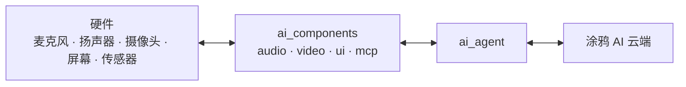

TuyaOpen AI 设备是**多模态**的：它接收语音、文本、摄像头图像以及设备/传感器数据，并以语音、屏幕文本和动作作出响应。本页对这四种模态进行分类，并说明每种模态如何在**硬件**（麦克风、扬声器、摄像头、屏幕、传感器）、**端侧软件**（`ai_components`）与**涂鸦 AI 云端**之间流动。

## 三层通路

每种模态都遵循同一条通路，`ai_agent` 是通往云端的唯一桥梁。每个模态模块负责一类外设，把数据交给智能体或从智能体接收数据。

你只需在 `Kconfig` 中启用产品需要的模态（`ENABLE_COMP_AI_*`）；未启用的模块不会被编译进固件。

## 1. 音频——语音进，语音出

语音助手的核心模态。

- **输入：** 麦克风 → `ai_audio_input` → 语音活动检测（VAD）——手动（按键触发）或自动（人声检测）——将语音切片，由 `ai_agent` 上传到云端 ASR。唤醒词监听由[唤醒对话模式](ai-components/ai-mode-wakeup)驱动。
- **输出：** 云端 TTS 与音乐 → `ai_audio_player` → 解码与重采样 → 扬声器。
- **硬件：** 麦克风、扬声器，以及用于按键说话的按钮。
- **组件：** [音频输入](ai-components/ai-audio-input)、[音频播放](ai-components/ai-audio-player)。

## 2. 视觉——图像进，预览出

- **输入：** 摄像头 → `ai_video_input` 抓取一帧 JPEG（`ai_video_get_jpeg_frame`）→ `ai_agent_send_image` 上传到云端视觉，用于视觉问答与图像理解。
- **输出 / 预览：** 实时摄像头画面通过视频显示回调本地渲染；云端下推的图像经由 `ai_picture` 流式显示。
- **硬件：** 摄像头、屏幕。
- **组件：** [视频输入](ai-components/ai-video-input)。

## 3. 文本——输入或识别进，渲染出

- **输入：** `ai_agent_send_text` 直接发送字符串；语音输入也会以 ASR 文本形式返回。
- **输出：** NLG 回复逐字流式返回，`ai_ui` 以你选择的样式渲染（微信气泡、chatbot 或 OLED）。
- **硬件：** 屏幕（串口 chatbot 示例还会用到串口）。
- **组件：** [AI Agent](ai-components/ai-agent)、[UI 管理](ai-components/ai-ui-manage)。

## 4. 传感 / 设备数据——状态进，动作出

这是云端 AI 感知和控制物理设备的方式。

- AI 通过 `ai_mcp` 暴露的 **MCP 工具**读取设备状态并触发动作：查询设备信息、切换对话模式、拍照、调节音量——以及你为自有传感器和执行器注册的任意自定义工具。
- 任意字节数据也可以通过 `ai_agent_send_file` 上传。
- **硬件：** 传感器、执行器、GPIO——经由你实现的 MCP 工具访问。
- **组件：** [MCP 服务端](ai-components/ai-mcp-server)、[MCP 工具](ai-components/ai-mcp-tools)。

## 各模态的处理位置

| 模态 | 输入（硬件 → 云端） | 输出（云端 → 硬件） | 组件 |
|------|----------------------|----------------------|------|
| **音频** | 麦克风 → VAD → 智能体 | TTS / 音乐 → 播放器 → 扬声器 | `ai_audio_input`、`ai_audio_player` |
| **视觉** | 摄像头 → JPEG → 智能体 | 预览 / 下推图像 → 屏幕 | `ai_video_input`、`ai_picture` |
| **文本** | `send_text` / ASR | NLG 流 → UI → 屏幕 | `ai_agent`、`ai_ui` |
| **传感 / 设备** | MCP 工具读取、`send_file` | MCP 工具动作 | `ai_mcp` |

:::note
四种模态共享 `ai_agent` 的同一个云端会话。对话模式决定设备*何时*聆听并上传；智能体决定数据*如何*到达云端；云端决定*返回什么*。
:::

## 相关文档

- [组件框架](ai-components/ai-components.md)——每种模态背后的模块
- [AI Agent](ai-components/ai-agent)——通往云端的唯一桥梁
- [语音对话模式](ai-components/ai-mode-manage)——设备何时聆听
- [在设备上暴露 MCP](ai-components/ai-mcp-server)——传感输入与设备控制
