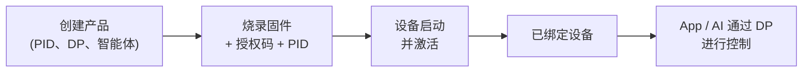

绑定是将物理设备与其在涂鸦云端的身份关联起来的过程，从而让涂鸦 App 和 AI 智能体能够识别、控制并更新该设备。本页介绍其中涉及的四个要素，以及将它们组合起来的先后顺序——在创建产品或烧录开发板之前，请先阅读本页。

:::note
绑定需要使用涂鸦云端，因此需要一个授权码（license key），并在平台上创建好产品。请参阅 [设备授权](../../quick-start/equipment-authorization)。
:::

## 四个要素

| 要素 | 所在位置 | 含义 |
|-------|----------|------------|
| **产品（PID）** | 涂鸦云端 | 设备型号在云端的定义——包括其功能（DP），以及对于 AI 产品而言的智能体。由产品 ID（`PID`）标识。 |
| **授权码（UUID + AuthKey）** | 烧录进设备 | 一组逐设备唯一的凭证，用于证明硬件是正品。 |
| **激活** | 设备 ↔ 云端 | 首次连接时，设备出示其授权码和 `PID`，向云端注册，并下载自身身份信息（`DeviceID`、密钥、schema）。 |
| **DP 控制** | App / AI ↔ 设备 | 激活之后，App 和智能体以数据点（DP）的形式下发指令；设备也以 DP 的形式上报状态。 |

一旦激活成功，设备即完成*绑定*：云端此时拥有一个与你的产品关联的唯一设备，控制指令即可双向流转。

## 绑定流程

## 你实际要做的事

绑定包含三个具体步骤，每一步都有对应的指南：

1. **在云端创建产品**——定义 `PID`、其功能（DP）、AI 智能体，以及一条自定义固件条目。→ [创建产品与智能体](creating-new-product)
2. **授权设备**——通过代码或烧录工具，将授权码（`UUID` + `AuthKey`）和 `PID` 写入固件。→ [设备授权](../../quick-start/equipment-authorization)
3. **编译并烧录**——`tos.py build && tos.py flash`。设备首次启动时进行配网（蓝牙或 Wi-Fi AP），并向你的产品发起激活。

完成后，设备会出现在涂鸦 App 中，智能体即可通过 DP 驱动它。

## 固件在何处与云端通信

在设备侧，[涂鸦 IoT 客户端](../iot-client/tuya-iot-client-reference)（`tuya_iot.h`）负责激活、MQTT 连接和 DP 上报。你的应用注册一个事件处理函数，并对收到的 DP 做出响应——参见 [创建产品与智能体](creating-new-product#在设备端处理控制) 中的处理函数讲解，以及最小示例 [switch_demo](../iot-client/demo-tuya-iot-light)。

## 参见

- [创建产品与智能体](creating-new-product) —— 云端侧的设置
- [涂鸦 IoT 客户端 API](../iot-client/tuya-iot-client-reference) —— 设备侧的云端客户端
- [switch_demo](../iot-client/demo-tuya-iot-light) —— 一个最小的已绑定设备示例
- [设备授权](../../quick-start/equipment-authorization) —— 获取并写入授权码
