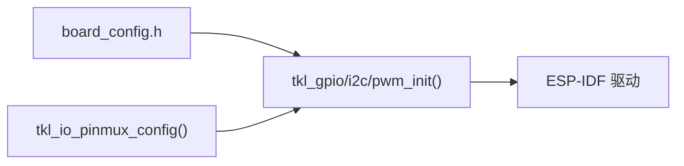

# ESP32 引脚映射

TuyaOpen 在 `TUYA_GPIO_NUM_E` 枚举值和物理 ESP32 GPIO 编号之间使用**直接 1:1 映射**。`TUYA_GPIO_NUM_18` 操作的是物理 `GPIO_NUM_18`。

该映射定义在 [`tkl_pin.c`](https://github.com/tuya/TuyaOpen-esp32/blob/master/tuya_open_sdk/tuyaos_adapter/src/drivers/tkl_pin.c) 的 `pinmap[]` 数组中，使用芯片特定的 `#ifdef` 块确定每个型号的可用 GPIO 范围。

## 各平台引脚映射文档

每个 ESP32 芯片型号都有专门的引脚映射文档，涵盖 GPIO 范围、UART 默认值、开发板配置和未实现的 TKL/TAL 接口：

- [ESP32（经典款）](pinmux/esp32-classic) -- 双核 Xtensa LX6，GPIO 0-39
- [ESP32-S3](pinmux/esp32-s3) -- 双核 Xtensa LX7，GPIO 0-48，AI/音频能力
- [ESP32-C3](pinmux/esp32-c3) -- 单核 RISC-V，GPIO 0-21，成本优化
- [ESP32-C6](pinmux/esp32-c6) -- 单核 RISC-V，GPIO 0-30，Wi-Fi 6

## 通用引脚映射机制

以下适用于所有 ESP32 芯片。

### I2C 引脚覆盖

I2C 引脚在 [`tkl_i2c.c`](https://github.com/tuya/TuyaOpen-esp32/blob/master/tuya_open_sdk/tuyaos_adapter/src/drivers/tkl_i2c.c) 中默认为 I2C0 `{GPIO0/GPIO1}`、I2C1 `{GPIO2/GPIO3}`。初始化前覆盖：

```c
tkl_io_pinmux_config(TUYA_GPIO_NUM_42, TUYA_IIC0_SCL);
tkl_io_pinmux_config(TUYA_GPIO_NUM_41, TUYA_IIC0_SDA);
tkl_i2c_init(TUYA_I2C_NUM_0, &cfg);
```

### PWM 引脚覆盖

PWM 在 [`tkl_pwm.c`](https://github.com/tuya/TuyaOpen-esp32/blob/master/tuya_open_sdk/tuyaos_adapter/src/drivers/tkl_pwm.c) 中默认为 6 个 LEDC 通道映射到 GPIO 18/19/22/23/25/26。覆盖方式：

```c
tkl_io_pinmux_config(TUYA_GPIO_NUM_5, TUYA_PWM0);
```

### 代码流程



## TKL/TAL 实现缺口（所有 ESP32 芯片）

以下 TKL/TAL 接口在 ESP32 适配器中**未实现**或为**空操作**：

| 接口 | 状态 | 替代方案 |
|------|------|---------|
| `tkl_spi` | **未实现**（适配器中无 `tkl_spi.c`） | 直接使用 ESP-IDF `spi_bus_*` 或 `boards/ESP32/common/lcd/` 中的板级 BSP |
| `tkl_pinmux` SPI 路由 | **空操作** | SPI 引脚在 `board_config.h` 中设置 |
| `tkl_io_pin_to_func()` | **桩函数**（返回 `OPRT_NOT_SUPPORTED`） | 实际未使用；引脚功能为隐式 |
| `tkl_dac` | **未实现** | 使用 ESP-IDF `dac_output_*`（仅 ESP32 经典款有 DAC） |
| `tkl_bt`（ESP32-S2） | **编译时排除** | ESP32-S2 无蓝牙硬件 |
| `tkl_i2s`（无 `ENABLE_AUDIO`） | **未编译** | 在 Kconfig 中启用 `ENABLE_AUDIO` |
| `tkl_display` | **无 TKL 抽象** | 显示使用板级 BSP + ESP-IDF LVGL |
| `tkl_qspi` | **未实现** | QSPI 显示屏由板级 BSP 处理 |

## 源代码参考

| 文件 | 用途 | 链接 |
|------|------|------|
| `tkl_pin.c` | GPIO pinmap 数组、init/read/write/IRQ | [tkl_pin.c](https://github.com/tuya/TuyaOpen-esp32/blob/master/tuya_open_sdk/tuyaos_adapter/src/drivers/tkl_pin.c) |
| `tkl_pinmux.c` | I2C/PWM 引脚路由（SPI 空操作） | [tkl_pinmux.c](https://github.com/tuya/TuyaOpen-esp32/blob/master/tuya_open_sdk/tuyaos_adapter/src/drivers/tkl_pinmux.c) |
| `tkl_uart.c` | UART0/1 引脚配置，USB JTAG 模式 | [tkl_uart.c](https://github.com/tuya/TuyaOpen-esp32/blob/master/tuya_open_sdk/tuyaos_adapter/src/drivers/tkl_uart.c) |
| `tkl_i2c.c` | I2C 总线，默认引脚，pinmux 覆盖 | [tkl_i2c.c](https://github.com/tuya/TuyaOpen-esp32/blob/master/tuya_open_sdk/tuyaos_adapter/src/drivers/tkl_i2c.c) |
| `tkl_pwm.c` | LEDC PWM 通道引脚映射 | [tkl_pwm.c](https://github.com/tuya/TuyaOpen-esp32/blob/master/tuya_open_sdk/tuyaos_adapter/src/drivers/tkl_pwm.c) |
| `tkl_gpio.h` | 可移植 GPIO API | [tkl_gpio.h](https://github.com/tuya/TuyaOpen/blob/master/tools/porting/adapter/gpio/tkl_gpio.h) |
| `board_config.h` | 各开发板引脚常量 | [boards/ESP32/](https://github.com/tuya/TuyaOpen/tree/master/boards/ESP32) |

## 参考资料

- [ESP32 与 TuyaOpen -- 概述](overview-esp32)
- [ESP32 支持功能](esp32-supported-features)
- [添加新的 ESP32 开发板](esp32-new-board)
