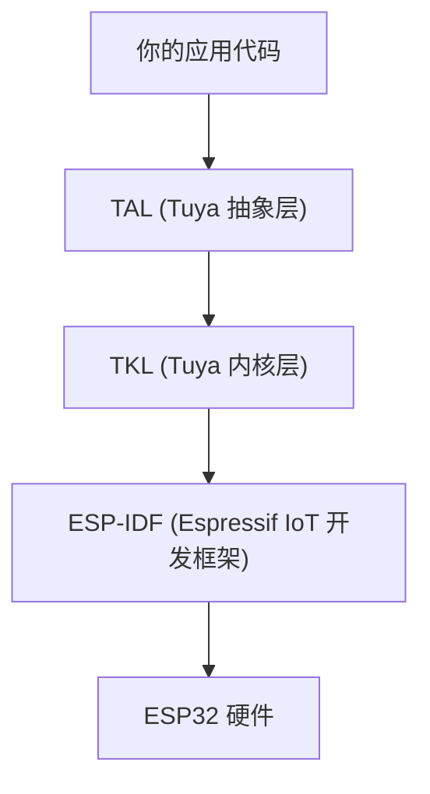

# ESP32 与 TuyaOpen

TuyaOpen 全面支持 Espressif ESP32 系列芯片，你可以使用与 Tuya T 系列、Linux 及其他支持平台相同的 TuyaOpen SDK 和 API，在 ESP32 硬件上构建物联网和 AI 应用。

## 为什么在 ESP32 上使用 TuyaOpen

如果你是现有的 ESP32 开发者，TuyaOpen 为你提供：

- **Tuya Cloud 集成** -- 开箱即用的设备激活、远程控制、OTA 和数据点 (DP)，无需自行编写云端协议栈。
- **跨平台可移植性** -- 使用 TuyaOpen 的 TAL/TKL 抽象编写一次应用代码，同一逻辑可运行在 T5AI、T2、T3、Raspberry Pi 和 ESP32 上，无需重写。
- **AI 能力** -- 通过统一 AI SDK 访问 Tuya AI Agent、语音交互 (ASR/TTS/KWS) 和 LLM 服务。
- **产品化路径** -- 从原型到量产：设备授权、授权码管理、OTA 固件更新和 Tuya Smart App 配网均已内置。
- **外设驱动库** -- 可复用的显示、音频编解码器、按键、LED 和传感器驱动，支持板级配置。

## 与 ESP-IDF 的关系

TuyaOpen 在 ESP32 上**构建于 ESP-IDF 之上**，而非替代它：

- **ESP-IDF** 仍然是底层 SDK。FreeRTOS、lwIP、NVS、Wi-Fi 驱动、蓝牙控制器均来自 IDF。
- **TKL 适配层** (`tkl_wifi.c`、`tkl_gpio.c` 等) 将 TuyaOpen 的可移植 API 调用转换为 ESP-IDF 函数调用。
- **你的应用代码** 调用 TAL/TKL API，这些 API 在所有 TuyaOpen 平台上保持一致。

你仍然可以使用 `tos.py idf` 直接访问 ESP-IDF 命令（如 `menuconfig`、`monitor`）进行底层配置。

## 支持的芯片和开发板

### 芯片型号

| 芯片 | Wi-Fi | 蓝牙 | 音频/AI | 说明 |
|------|-------|------|---------|------|
| ESP32 | 支持 | 支持 | 有限 | 经典蓝牙 + BLE |
| ESP32-C3 | 支持 | BLE 5.0 | 不支持 | RISC-V 内核，成本优化 |
| ESP32-C6 | 支持 | BLE 5.0 | 不支持 | Wi-Fi 6, Thread/Zigbee |
| ESP32-S3 | 支持 | BLE 5.0 | 支持 | 双核, PSRAM, AI/音频能力 |
| ESP32-S2 | 支持 | 不支持 | 不支持 | TuyaOpen 中蓝牙**不支持** |

:::warning ESP32-S2 限制
ESP32-S2 没有蓝牙硬件。TuyaOpen BLE 适配器 (`tkl_bt.c`) 在此型号上被排除。如果你的应用需要 BLE 配网或蓝牙连接，请使用 ESP32、ESP32-S3 或 ESP32-C3/C6。
:::

### 预配置开发板

TuyaOpen 为以下 ESP32 开发板提供板级支持包 (BSP)：

| 开发板 | 芯片 | 显示 | 音频 | 配置文件 |
|-------|------|------|------|----------|
| ESP32 (通用) | ESP32 | 支持 | 不支持 | `ESP32.config` |
| ESP32-S3 (通用) | ESP32-S3 | 不支持 | 不支持 | `ESP32-S3.config` |
| ESP32-C3 (通用) | ESP32-C3 | 不支持 | 不支持 | `ESP32-C3.config` |
| ESP32-C6 (通用) | ESP32-C6 | 不支持 | 不支持 | `ESP32-C6.config` |
| DNESP32S3 | ESP32-S3 | 支持 | 支持 | `DNESP32S3.config` |
| DNESP32S3-BOX | ESP32-S3 | 支持 | 支持 | `DNESP32S3_BOX.config` |
| DNESP32S3-BOX2 | ESP32-S3 | 支持 | 支持 | `DNESP32S3_BOX2_WIFI.config` |
| ESP32S3 Bread Compact | ESP32-S3 | 不支持 | 支持 | `ESP32S3_BREAD_COMPACT_WIFI.config` |
| Waveshare S3 AMOLED 1.8" | ESP32-S3 | 支持 (触摸) | 支持 | `WAVESHARE_ESP32S3_Touch_AMOLED_1.8.config` |
| XingZhi ESP32S3 Cube OLED | ESP32-S3 | 支持 (OLED) | 支持 | `XINGZHI_ESP32S3_Cube_0_96OLED_WIFI.config` |
| Waveshare ESP32-C6 DevKit | ESP32-C6 | 不支持 (LED) | 不支持 | `WAVESHARE_ESP32C6_DEV_KIT_N16.config` |

## ESP-IDF 库 vs TuyaOpen 库的选择

| 需求 | 使用 | 原因 |
|------|------|------|
| Wi-Fi, BLE, GPIO, UART, SPI, I2C, PWM, ADC, 定时器 | TuyaOpen TKL/TAL API | 跨平台，API 一致 |
| Tuya Cloud、设备管理、OTA、DP | TuyaOpen 云服务 | Tuya 生态必需 |
| AI (ASR, TTS, LLM, MCP) | TuyaOpen AI SDK | 与 Tuya AI Agent 集成 |
| LVGL 图形 | ESP32 的 LVGL（通过 IDF 组件） | ESP32 使用自己的 LVGL 移植 |
| 显示驱动 (LCD 初始化, SPI 总线) | `boards/ESP32/common/display/` | 板级 BSP，调用 ESP-IDF LCD API |
| 音频编解码器 (ES8311, ES8388) | `boards/ESP32/common/audio/` | 板级 BSP，调用 ESP-IDF I2S/codec API |
| 厂商特定 IDF API (NVS, ESP-NOW, ULP) | 通过 `tos.py idf` 直接使用 ESP-IDF | TuyaOpen 未做抽象 |
| 第三方 IDF 组件 | ESP-IDF 组件管理器 | 添加到项目的 `idf_component.yml` |

:::tip 经验法则
所有你希望跨平台移植的功能，使用 TuyaOpen API。只有 ESP32 特有且 TuyaOpen 未抽象的功能（如 ULP 协处理器、ESP-NOW、ESP-MESH）才直接使用 ESP-IDF。
:::

## ESP32 TKL 功能支持

ESP32 的 TKL 适配层实现了以下接口：

| TKL 模块 | 状态 | 源文件 |
|----------|------|--------|
| `tkl_wifi` | 支持 | `tuyaos_adapter/src/drivers/tkl_wifi.c` |
| `tkl_bt` (BLE) | 支持（ESP32-S2 除外） | `tuyaos_adapter/src/drivers/tkl_bt.c` |
| `tkl_pin` (GPIO) | 支持 | `tuyaos_adapter/src/drivers/tkl_pin.c` |
| `tkl_uart` | 支持 | `tuyaos_adapter/src/drivers/tkl_uart.c` |
| `tkl_pwm` | 支持 | `tuyaos_adapter/src/drivers/tkl_pwm.c` |
| `tkl_adc` | 支持 | `tuyaos_adapter/src/drivers/tkl_adc.c` |
| `tkl_i2c` | 支持 | `tuyaos_adapter/src/drivers/tkl_i2c.c` |
| `tkl_i2s` | 支持（需启用音频） | `tuyaos_adapter/src/drivers/tkl_i2s.c` |
| `tkl_spi` | 支持 | `tuyaos_adapter/src/drivers/tkl_spi.c` |
| `tkl_flash` | 支持 | `tuyaos_adapter/src/drivers/tkl_flash.c` |
| `tkl_timer` | 支持 | `tuyaos_adapter/src/drivers/tkl_timer.c` |
| `tkl_watchdog` | 支持 | `tuyaos_adapter/src/drivers/tkl_watchdog.c` |
| `tkl_rtc` | 支持 | `tuyaos_adapter/src/drivers/tkl_rtc.c` |
| `tkl_ota` | 支持 | `tuyaos_adapter/src/drivers/tkl_ota.c` |
| `tkl_network` | 支持 | `tuyaos_adapter/src/drivers/tkl_network.c` |
| `tkl_pinmux` | 支持 | `tuyaos_adapter/src/drivers/tkl_pinmux.c` |

## 下一步

- [ESP32 快速开始](esp32-quick-start) -- 在 ESP32 上构建和烧录你的第一个 TuyaOpen 项目
- [从 ESP-IDF 迁移到 TuyaOpen](esp32-migration-guide) -- 移植现有 ESP-IDF 项目
- [添加新的 ESP32 开发板](esp32-new-board) -- 为自定义硬件创建 BSP
- [ESP32 引脚映射](esp32-pin-mapping) -- 各开发板的 GPIO、UART、I2C、SPI、PWM 引脚分配
- [ESP32 支持功能](esp32-supported-features) -- 各芯片型号的详细功能矩阵

## 参考资料

- [Espressif ESP32 数据手册](https://www.espressif.com.cn/sites/default/files/documentation/esp32_datasheet_en.pdf)
- [TuyaOpen-esp32 GitHub 仓库](https://github.com/tuya/TuyaOpen-esp32)
- [TuyaOpen 快速开始](/docs/quick-start)
- [支持的硬件列表](/docs/hardware-specific)
