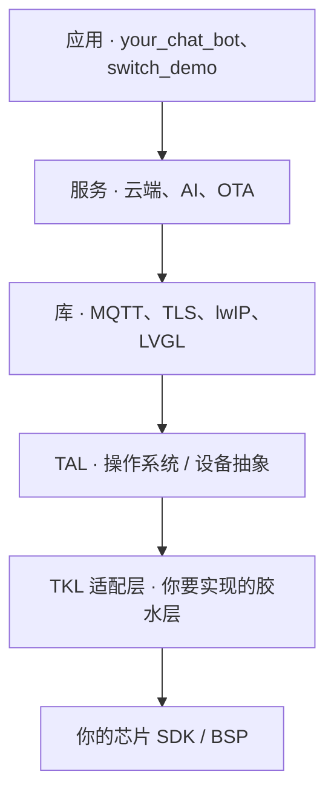

本指南面向希望让自家硬件运行 TuyaOpen 的**芯片原厂、模组原厂和开发板原厂**。移植，就是实现一层薄薄的适配层——"胶水层"——把你的芯片 SDK 映射到 TuyaOpen 的硬件抽象上，从而让每一个 TuyaOpen 应用、云服务和 AI 能力都能在你的平台上原样运行。本页说明你要实现什么、可以从哪些参考移植工程直接复制，以及完成之后这件事为你带来的意义与价值。

## 适用对象

三种原厂角色的工作量各不相同，开始前先确认你属于哪一种。

| 你是… | 目标 | 你要做的事 | 从这里开始 |
|-------|------|-----------|-----------|
| **芯片原厂**（硅片 / SDK 拥有者） | 让你的 SoC 或 MCU 成为一等 TuyaOpen 目标平台 | 基于你的芯片 SDK 实现完整的 TKL 适配（系统、外设、连接、存储） | 本指南 →[创建平台](new-platform)→[适配新平台](porting-platform) |
| **模组原厂** | 基于某芯片推出模组 | 复用该芯片的平台移植；补充模组的引脚 / Flash / 射频配置 | [适配新平台](porting-platform)，再做板级配置 |
| **开发板 / DevKit 原厂** | 围绕已支持的芯片推出开发板 | 仅新增一个开发板定义——无需做平台移植 | [适配新开发板](new-board) |

如果你的芯片已被支持（Tuya T 系列、ESP32、BK7231X、GigaDevice、Linux……），那么你属于模组或开发板原厂：跳过平台移植，直接定义一块开发板即可。

## 全局视角：胶水层在哪里

TuyaOpen 是分层的。应用、服务和库都是**与平台无关**的，原样发布。你的移植工作位于最底部的适配层——**Tuya Kernel Layer（TKL）**——它向上对接 TuyaOpen，向下调用你的芯片 SDK 与 BSP。

TKL 线以上的一切都被复用。你的工作就是 TuyaOpen 与你的硅片相接的这一层：通过调用你的 SDK 来实现 TKL 接口。由于 TKL 接口与 TuyaOS 完全一致，一次移植也能直接运行商用 TuyaOS SDK，无需返工。

## 从参考移植工程开始

不要从零开始。Tuya 为多个平台维护了完整、可用的胶水层移植工程。复制最接近你芯片的那个，把其中的 SDK 调用替换为你自己的即可。

| 平台 | 参考胶水层仓库 | 适合作为以下的范本 |
|------|---------------|--------------------|
| Tuya T5（Wi-Fi + BT AI SoC） | [TuyaOpen-T5AI](https://github.com/tuya/TuyaOpen-T5AI) | 完整的、具备 AI 能力的 Wi-Fi + 蓝牙 SoC 移植 |
| GigaDevice | [TuyaOpen-GigaDevice](https://github.com/tuya/TuyaOpen-GigaDevice) | GigaDevice MCU / Wi-Fi 移植 |
| Espressif ESP32 | [TuyaOpen-esp32](https://github.com/tuya/TuyaOpen-esp32) | 使用**厂商自带 lwIP**（适配 `tkl_network.c`） |
| Tuya T2 | [TuyaOpen-T2](https://github.com/tuya/TuyaOpen-T2) | 使用 **TuyaOpen 的 lwIP**（适配 `tkl_lwip.c`） |
| Ubuntu / Linux | [TuyaOpen-ubuntu](https://github.com/tuya/TuyaOpen-ubuntu) | 先在 PC 上学习流程并完成 bring-up |

:::tip
即使 [Ubuntu 参考工程](https://github.com/tuya/TuyaOpen-ubuntu) 不是你的目标平台，也建议先把它跑起来。它能让你端到端运行 `switch_demo`——配网、激活、云端控制——从而在动硬件之前就理解你的移植需要复现的行为。
:::

## 你要实现什么：适配面

`tos.py new platform` 会从 `tools/porting/adapter` 在 `platform/<你的芯片>/tuyaos/` 下生成适配模板。你通过调用芯片 SDK 来填充这些 `.c` 文件。适配面横跨四个领域——从底层硬件接口一直到网络协议接口。

| 领域 | 需要实现的 TKL 接口 | 参考 |
|------|---------------------|------|
| **系统与 OS** | system、thread、mutex、semaphore、timer、日志输出 | [系统编程 APIs](../../tkl-api/tkl_system) |
| **硬件接口** | GPIO、UART、I2C、SPI、PWM、ADC、DAC、I2S、pinmux、watchdog、RTC | [硬件接口 APIs](../../tkl-api/tkl_gpio) |
| **连接** | Wi-Fi、Bluetooth、网络套接字（`tkl_network`）或 lwIP（`tkl_lwip`）、有线以太网 | [tkl_wifi](../../tkl-api/tkl_wifi)、[tkl_bluetooth](../../tkl-api/tkl_bluetooth) |
| **存储与 OTA** | Flash、OTA；文件系统使用 LittleFS（TuyaOpen）或厂商 FS | [tkl_flash](../../tkl-api/tkl_flash)、[tkl_ota](../../tkl-api/tkl_ota) |

你只需实现产品所需的接口——`menuconfig` 允许你只启用 Wi-Fi、只启用 BLE 或两者都启用，只有对应的模板才会被生成。

:::note
两个连接方面的选择最关键。网络协议栈：要么保留你 SDK 的 lwIP 并适配 `tkl_network.c`（参考 [TuyaOpen-esp32](https://github.com/tuya/TuyaOpen-esp32/blob/master/tuya_open_sdk/tuyaos_adapter/src/drivers/tkl_network.c)），**要么**使用 TuyaOpen 的 lwIP 并适配 `tkl_lwip.c`（参考 [TuyaOpen-T2](https://github.com/tuya/TuyaOpen-T2/blob/master/tuyaos/tuyaos_adapter/src/tkl_lwip.c)）——两者只需适配其一。TLS：使用你 SDK 的 Mbed TLS 或 TuyaOpen 的。完整的 RTOS 移植参考见 [将 TuyaOS 移植到 RTOS 平台](https://developer.tuya.com/zh/docs/iot-device-dev/TuyaOS-translation_rtos?id=Kcrwraf21847l)。
:::

## 移植流程

1. **理解行为**——在 Ubuntu 参考工程上运行 `switch_demo`；阅读[快速开始](../../quick-start/index.md)与 [tos.py 使用指南](../../tos-tools/tos-guide)。
2. **生成平台**——`tos.py new platform` 会搭建 `platform/<你的芯片>/` 与 `boards/<你的芯片>/`。见[创建平台](new-platform)。
3. **接好构建**——编写拉取工具链、执行编译/链接的脚本，产出 QIO/UA/UG 固件。见[适配新平台](porting-platform)。
4. **实现 TKL 适配**——以最接近你芯片的参考仓库为起点，用你的 SDK 填充生成的 `.c` 文件。
5. **为 TuyaOpen 预留 Flash**——启用 `ENABLE_FLASH`，并预留一段未使用的 Flash 区域（避开固件区，且匹配擦写粒度）用于设备授权与文件系统。
6. **用 Demo 验证**——构建 `apps/tuya_cloud/switch_demo`，完成配网、激活并控制设备，以确认移植。

## 建议的 bring-up 顺序

逐层 bring-up 并验证平台——每一层都依赖前一层，因此你始终在可用的基座上测试。每个阶段都有独立的文档，包含目标、需要实现的具体文件，以及如何验证：

| 阶段 | 目标 | 关键文件 |
|------|------|----------|
| [1. 系统与日志](bring-up/system-and-logs) | 启动、OS 原语、日志从 UART 输出 | `tkl_system.c`、`tkl_output.c`、`tkl_uart.c` |
| [2. Flash 与存储](bring-up/flash-and-storage) | 授权数据可持久化 | `tkl_flash.c` |
| [3. Wi-Fi 与网络](bring-up/wifi-and-network) | 连接 AP、访问互联网（TLS） | `tkl_wifi.c`、`tkl_network.c` / `tkl_lwip.c` |
| [4. 云端连接](bring-up/cloud-connection) | 配网、激活、运行 `switch_demo` | `tkl_rtc.c`、RNG、`tkl_bluetooth.c`（可选） |
| [5. 外设与 AI](bring-up/peripherals-and-ai) | 音频/显示/BLE，再到 `your_chat_bot` | `tkl_i2s.c`、`tkl_gpio.c`、… |

## 为什么要把你的芯片接入 TuyaOpen

一次移植，就把你的硅片连接到了完整的 AI + IoT 生态。具体而言，移植完成后：

- **每个 TuyaOpen 应用都能在你的芯片上原样运行**——`switch_demo`、`your_chat_bot` 以及更广的应用库，在适配通过的当天就能工作，无需逐个应用适配。
- **即刻获得 Tuya 云与 AI 平台**——你的客户无需自建云基础设施，即可获得设备配网、OTA、智能体平台、语音以及 Tuya App。
- **缩短客户的上市时间**——基于你芯片的模组与开发板厂商，直接继承一套成型的软件栈，交付的是产品而不是 bring-up 工程。这让你的硅片更易被设计选用。
- **一次编写，处处部署**——客户团队编写的同一份应用代码可在你的芯片以及其他所有 TuyaOpen 目标平台上运行，让你的平台凭硬件实力竞争，而非靠锁定。
- **免费获得 TuyaOS 兼容性**——由于 TKL 接口与 TuyaOS 一致，同一份移植也能运行 Tuya 的商用 SDK，打开量产级的 Tuya 生态。
- **生态曝光**——已支持的平台会出现在文档、开发板列表和 IDE 中，把你的芯片呈现在每一位 TuyaOpen 开发者面前。

一言以蔽之：一层适配，就把一个裸的芯片 SDK 变成一个完整的、连云的、AI 就绪的产品平台——也让你的硅片成为所有在其之上构建者的省心之选。

## 相关文档

- [创建平台](new-platform)——用 `tos.py new platform` 搭建平台
- [适配新平台](porting-platform)——构建与 TKL 适配的详细步骤
- [适配新开发板](new-board)——面向已支持芯片上的开发板 / DevKit 原厂
- [硬件接口 APIs](../../tkl-api/tkl_gpio) · [tkl_wifi](../../tkl-api/tkl_wifi) · [tkl_bluetooth](../../tkl-api/tkl_bluetooth)——你要实现的接口
