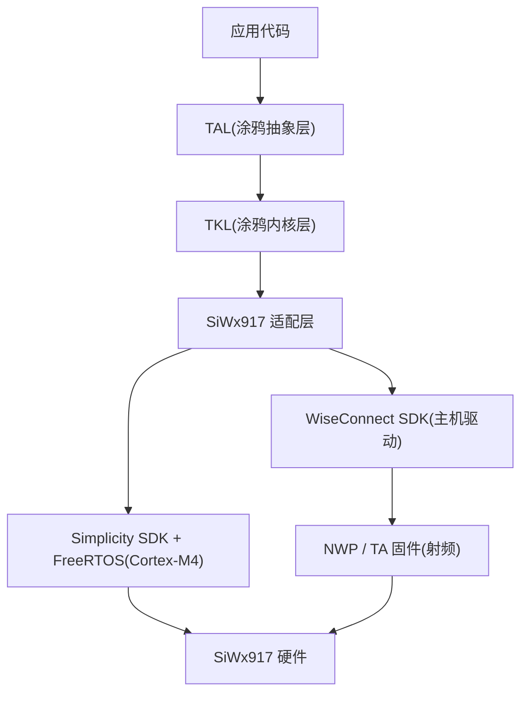

TuyaOpen 在 Silicon Labs 官方的 WiseConnect SDK、Simplicity SDK 和 FreeRTOS 之上运行 SiWx917,你可以使用与 Tuya T 系列、ESP32、Linux 及其他支持平台相同的 TuyaOpen SDK 和 API,在 SiWx917 硬件上构建物联网和 AI 应用。

## 为什么在 SiWx917 上使用 TuyaOpen

如果你已经在 SiWx917 上开发,TuyaOpen 为你提供:

- **Tuya Cloud 集成**:开箱即用的设备激活、远程控制、OTA 和数据点 (DP),无需自行编写云端协议栈。
- **跨平台可移植性**:针对 TuyaOpen 的 TAL/TKL 抽象编写一次应用代码,同一逻辑即可运行在 T5AI、T2、T3、ESP32、Raspberry Pi 和 SiWx917 上,无需重写。
- **AI 能力**:通过统一 AI SDK 访问 Tuya AI Agent、语音交互 (ASR/TTS/KWS) 和 LLM 服务。AI 开发板正是为此设计——对话按键、模拟麦克风和扬声器、显示屏一应俱全。
- **产品化路径**:设备授权、license 管理、OTA 固件升级、涂鸦智能 App 配网全部内置,从原型到量产。
- **外设库**:显示、音频、按键、LED 驱动开箱即用,板级配置管理。

## 芯片:两个处理器

SiWx917 (SiWG917) 是一款 Wi-Fi 6 + 蓝牙 LE SoC,内部有两个处理器,烧录和调试方式因此与众不同:

| 处理器 | 运行内容 | 固件 |
|--------|----------|------|
| Cortex-M4 | 应用固件、FreeRTOS、lwIP、全部 TuyaOpen 代码 | 由你的应用构建产出(`tos.py build`),每次更新都要烧录 |
| NWP(网络无线处理器) | Wi-Fi 和 BLE 协议栈、射频 | TA 固件(`RS9117_WC_SI.rps`),每台设备只需烧一次——开发板出厂时通常已烧录 |

M4 应用没有 TA 固件就无法启动。`tos.py flash` 会读取设备的 TA 版本,只在缺失时才提供烧写;详见[快速开始](siwx917-quick-start#5-烧录固件)。

## 与 Silicon Labs SDK 的关系

TuyaOpen 在 SiWx917 上构建于厂商 SDK 之上,而非取而代之:

- **Simplicity SDK** 提供 CMSIS、外设驱动(GPIO、GSPI、ADC、PWM、RTC、UART)和 FreeRTOS 移植层。TKL 适配层(`tkl_gpio.c`、`tkl_spi.c` 等)把 TuyaOpen 的跨平台 API 翻译成这些驱动调用。
- **WiseConnect SDK** 提供与 NWP 通信的主机驱动,以及 TA 固件镜像本身。Wi-Fi 和 BLE 都经由它。
- **Silicon Labs SLC 和 Simplicity Commander** 是构建和烧录工具,由平台引导脚本自动下载到 `platform/SIWX917/tools/`——不会写入系统目录。

## 平台层目录与首次构建

TuyaOpen 的每个平台在 `platform/` 下各占一个目录,按 `platform/platform_config.yaml` 作为独立 git 仓库获取。SiWx917 的这一层(`platform/SIWX917/`)在构建方式上与 T5AI 平台不同,第一次编译前值得先了解。

### `platform/SIWX917/` 目录结构

| 路径 | 内容 |
|------|------|
| `tuyaos_adapter/` | TKL 适配层(`tkl_*.c`)——把 TuyaOpen 的跨平台 API 翻译成 Simplicity SDK 外设驱动和 WiseConnect 主机驱动调用 |
| `mcu/` | 芯片级代码和厂商补丁(如 WiseConnect 补丁、MP3 内部 RAM 暂存池) |
| `sdks/` | 厂商 SDK,首次构建时克隆:`simplicity_sdk/`、`WiseConnect/` |
| `slc/`、`tuyaopen-si91x.slsdk`、`script/generate`、`build_setup.py` | Silicon Labs SLC 工程描述,以及编译前把它生成 CMake/源码的步骤(`build_kconfig2slcp.py` 把 Kconfig 写进 `.slcp`) |
| `tools/` | Silicon Labs SLC CLI 和 Simplicity Commander,首次构建时安装 |
| `script/bootstrap` | 安装 ARM 工具链、Java 运行时(SiLabs 工具是 Java 程序)和 SiLabs 工具 |
| `platform_libsdepend` | 厂商 SDK 清单:哪些仓库、哪些版本、打什么补丁 |
| `platform_prepare.py` | 首次构建时运行,拉取下表所列内容 |
| `platform_flash_bridge.py` | `tos.py flash` 的执行入口——走 Commander + J-Link,或 ISP 串口 |
| `toolchain_file.cmake` | 在共享的 `platform/tools/` 下定位 ARM GNU 工具链 |
| `GETTING_STARTED.md` | 平台自带文档,含 ROM bootloader 恢复流程 |

### 第一次构建会拉取什么

第一次 `tos.py build` 会运行 `platform_prepare.py`,所有内容均安装在 `platform/SIWX917/` 内部——不写入系统目录。

| 拉取内容 | 安装位置 | 体积(Linux x64) |
|----------|------|------------------------|
| GNU Arm Embedded 工具链 | `platform/tools/` | 约 700 MB |
| Java 运行时(Temurin 21,SiLabs 工具依赖) | `platform/SIWX917/tools/jre/` | — |
| SLC CLI | `tools/slc/` | 约 500 MB |
| Simplicity Commander | `tools/commander/` | 约 90 MB |
| Simplicity SDK v2025.6.1(含子模块) | `sdks/simplicity_sdk/` | 约 2.8 GB |
| WiseConnect v4.0.0-ifc2fc + 平台补丁 | `sdks/WiseConnect/` | 约 560 MB |

预留 4–5 GB 磁盘。

## 支持的开发板

| 开发板 | 模组 | 亮点 |
|--------|------|------|
| `SIWX917_AI_DEV_KIT` | SiWG917M111MGTBA | 涂鸦 AI 开发板:ST7789 320×240 SPI 显示屏、模拟麦克风 + 扬声器、对话按键 SW1、SW2/SW3 按键、RGB LED |
| `BRD2605A` | SiWG917M | Silicon Labs 开发板;板载调试器提供 J-Link VCOM,一根 USB 线即可完成烧录和查看日志,无需额外接线 |

### SIWX917_AI_DEV_KIT(世强 AI 开发套件)

  

| 资料 | 链接 |
|------|------|
| 原理图 V1.1(PDF) | [SK_SiWx917_AI_MB_Schematic_V1.1.pdf](/docs/hardware/siwx917/SK_SiWx917_AI_MB_Schematic_V1.1.pdf) |
| 购买(世强) | [https://www.sekorm.com/product/603942256.html](https://www.sekorm.com/product/603942256.html) |

### BRD2605A(Silicon Labs 开发板)

  

板载 SEGGER J-Link 调试器与虚拟串口(VCOM),一根 USB Type-C 线即可完成烧录和查看日志;带温湿度、环境光、六轴传感器和 Qwiic 扩展接口。

| 资料 | 链接 |
|------|------|
| 原理图(PDF) | [BRD2605A-A02-schematic.pdf](https://www.silabs.com/documents/public/schematic-files/BRD2605A-A02-schematic.pdf) |
| 用户指南 UG581(PDF) | [UG581-BRD2605A-user-guide.pdf](https://www.silabs.com/documents/public/user-guides/ug581-brd2605a-user-guide.pdf) |
| 产品页 | [https://www.silabs.com/development-tools/wireless/wi-fi/siwx917-dk2605a-wifi-6-bluetooth-le-soc-dev-kit](https://www.silabs.com/development-tools/wireless/wi-fi/siwx917-dk2605a-wifi-6-bluetooth-le-soc-dev-kit) |
| 购买(Digi-Key) | [https://www.digikey.com/en/products/detail/silicon-labs/SIWX917-DK2605A/24710290](https://www.digikey.com/en/products/detail/silicon-labs/SIWX917-DK2605A/24710290) |

## 下一步

- [SiWx917 快速开始](siwx917-quick-start):在 SIWX917_AI_DEV_KIT 上构建、烧录并配网你的第一个 TuyaOpen 项目。
- [适配新硬件](../porting/bring-your-chip-to-tuyaopen):TuyaOpen 通用移植指南。

## 相关文档

- [Silicon Labs 文档站](https://docs.silabs.com/)
- [WiSeConnect SDK 仓库(GitHub)](https://github.com/SiliconLabs/wiseconnect)
- [SiWx917-DK2605A 产品页](https://www.silabs.com/development-tools/wireless/wi-fi/siwx917-dk2605a-wifi-6-bluetooth-le-soc-dev-kit)
