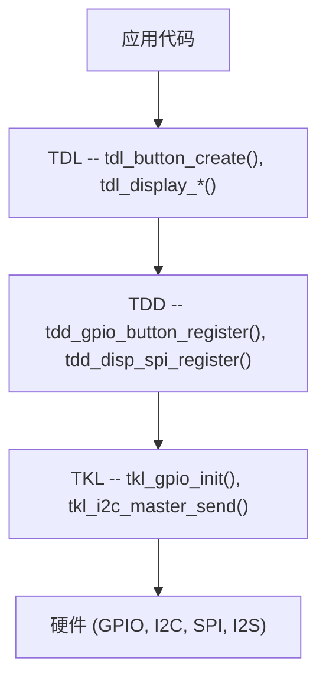

# TDD/TDL 驱动架构

TuyaOpen 使用两层外设驱动框架：**TDL**（Tuya Driver Layer）管理设备生命周期并提供应用 API，而 **TDD**（Tuya Device Driver）实现芯片特定的硬件访问。这种分离让你可以在不修改应用代码的情况下添加新硬件。

## 层次概览



| 层 | 前缀 | 职责 | 编写者 |
|----|------|------|--------|
| **TDL** | `tdl_*` | 设备管理、注册、应用 API | TuyaOpen SDK（通常不需要修改） |
| **TDD** | `tdd_*` | 实现 TDL 接口的硬件特定驱动 | 你（添加新传感器/显示屏/编解码器时） |
| **TKL** | `tkl_*` | 平台抽象（GPIO、I2C、SPI、UART） | 平台适配器（每个芯片） |

## 注册模式

每个外设类别遵循相同的模式：

### 1. TDL 定义接口结构体

```c
typedef struct {
    OPERATE_RET (*create)(TDL_OPRT_INFO *dev);
    OPERATE_RET (*delete)(TDL_OPRT_INFO *dev);
    OPERATE_RET (*read_value)(TDL_OPRT_INFO *dev, uint8_t *value);
} TDL_BUTTON_CTRL_INFO;
```

### 2. TDD 实现接口并注册

```c
OPERATE_RET tdd_gpio_button_register(char *name, BUTTON_GPIO_CFG_T *cfg)
{
    TDL_BUTTON_CTRL_INFO ctrl = {
        .create     = __tdd_create_gpio_button,
        .delete     = __tdd_delete_gpio_button,
        .read_value = __tdd_read_gpio_value,
    };
    return tdl_button_register(name, &ctrl, &device_info);
}
```

### 3. 板级初始化调用 TDD 注册

```c
void board_register_hardware(void)
{
    BUTTON_GPIO_CFG_T btn_cfg = {
        .pin = BOARD_BUTTON_PIN,
        .level = BOARD_BUTTON_ACTIVE_LV,
        .mode = BUTTON_IRQ_MODE,
    };
    tdd_gpio_button_register("power_btn", &btn_cfg);
}
```

### 4. 应用仅使用 TDL

```c
board_register_hardware();

TDL_BUTTON_HANDLE handle;
TDL_BUTTON_CFG_T cfg = { .long_start_valid_time = 3000 };
tdl_button_create("power_btn", &cfg, &handle);
tdl_button_event_register(handle, TDL_BUTTON_PRESS_DOWN, my_callback);
```

## 外设类别

| 类别 | TDL 头文件 | TDD 示例 | 源码路径 |
|------|-----------|----------|----------|
| 按键 | `tdl_button_driver.h` | `tdd_button_gpio` | `src/peripherals/button/` |
| LED | `tdl_led_driver.h` | `tdd_led_gpio` | `src/peripherals/led/` |
| LED 像素 | `tdl_pixel_driver.h` | `tdd_ws2812`, `tdd_sm16703p` | `src/peripherals/leds_pixel/` |
| 显示 | `tdl_display_driver.h` | `tdd_disp_spi`, `tdd_disp_rgb` | `src/peripherals/display/` |
| 音频 | `tdl_audio_driver.h` | `tdd_audio` (T5AI), `tdd_audio_alsa` | `src/peripherals/audio_codecs/` |
| 摄像头 | `tdl_camera_driver.h` | `tdd_camera_dvp_ov2640` | `src/peripherals/camera/` |
| 触摸 | `tdl_tp_driver.h` | `tdd_tp_i2c_ft6336`, `tdd_tp_i2c_gt911` | `src/peripherals/tp/` |
| 红外 | `tdl_ir_driver.h` | `tdd_ir_driver` | `src/peripherals/ir/` |
| 摇杆 | `tdl_joystick_driver.h` | `tdd_joystick` | `src/peripherals/joystick/` |
| 传输 | `tdl_transport_driver.h` | `tdd_transport_uart` | `src/peripherals/transport/` |

## 不使用 TDL/TDD 的外设

部分外设直接使用 TKL 调用，不使用注册框架：

| 外设 | 模式 | 示例 |
|------|------|------|
| IMU (BMI270) | 厂商库 + `tkl_i2c_*` | `examples/peripherals/imu/bmi270/` |
| 编码器 | 独立 `drv_encoder` | `src/peripherals/encoder/` |
| SHT3x/SHT4x | 直接 I2C 读取 | `examples/peripherals/i2c/sht3x_4x_sensor/` |
| PMIC (AXP2101) | 厂商驱动 | `src/peripherals/pmic/axp2101/` |

对于简单传感器（温度、湿度、压力），通常直接使用 TKL I2C 而不创建 TDL/TDD 层。参见[编写新的传感器驱动](tutorials/writing-sensor-driver)。

## Kconfig 集成

每个外设通过 `boards/{platform}/TKL_Kconfig` 中的 Kconfig 开关控制：

```kconfig
config ENABLE_BUTTON
    bool
    default n

config ENABLE_LED
    bool
    default n
```

板级 Kconfig 文件选择启用哪些外设：

```kconfig
config BOARD_CONFIG
    select ENABLE_BUTTON
    select ENABLE_LED
    select ENABLE_AUDIO
```

构建系统仅编译已启用的 TDD 驱动。

## 参考资料

- [编写新的传感器驱动](tutorials/writing-sensor-driver)
- [将传感器库迁移到 TuyaOpen](tutorials/migrating-sensor-driver)
- [显示驱动集成](tutorials/display-driver-guide)
- [音频编解码器驱动指南](tutorials/audio-codec-guide)
- [按键驱动](button)
- [显示驱动](display)
- [音频驱动](audio)
