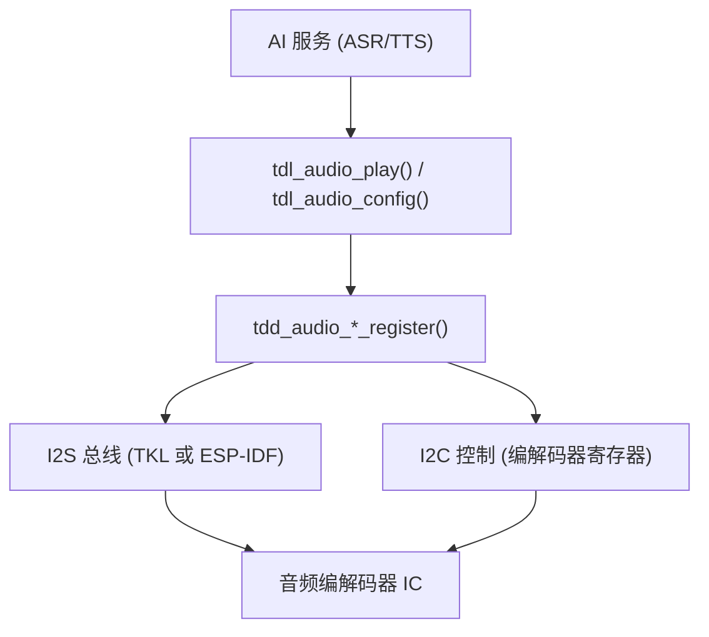

TuyaOpen 中的编解码器驱动将音频编解码器 IC 接入 `tdl_audio_*` 应用接口，使应用无需直接操作 I2S 或 I2C 总线即可播放与采集 PCM。本指南介绍如何为语音交互、音频播放和 AI 应用集成编解码器。

## 前置条件

- 阅读 [TDD/TDL 驱动架构](../driver-architecture)
- 具备 I2S 与 I2C 接口的开发板
- 音频编解码器数据手册（如 ES8311、ES8388、ES8389）

## 音频架构



## TDL 音频接口

应用通过 `tdl_audio_*` 交互：

```c
tdl_audio_find("audio_device", &handle);
tdl_audio_open(handle, &audio_cfg);
tdl_audio_play(handle, pcm_data, len);
tdl_audio_close(handle);
```

## 平台差异

| 方面 | T5AI | ESP32-S3 |
|------|------|----------|
| TDD 位置 | `src/peripherals/audio_codecs/tdd_audio/` | `boards/ESP32/common/audio/` |
| I2S 驱动 | TKL `tkl_i2s_*` | ESP-IDF `i2s_channel_*` |
| I2C 控制 | TKL `tkl_i2c_*` | ESP-IDF `i2c_master_*` |
| 编解码器库 | 内部 | `esp_codec_dev`（ESP-IDF 组件） |
| 支持的编解码器 | 平台音频 IC | ES8311、ES8388、ES8389、无编解码器（DAC） |

## ESP32 音频编解码器注册流程

以 ES8311 为例（来自 `boards/ESP32/common/audio/tdd_audio_8311_codec.c`）：

### 1. 配置编解码器

```c
TDD_AUDIO_8311_CODEC_T codec_cfg = {
    .i2c_cfg = {
        .i2c_scl_io = I2C_SCL_IO,
        .i2c_sda_io = I2C_SDA_IO,
        .i2c_port = 0,
        .i2c_addr = 0x18,
    },
    .i2s_cfg = {
        .i2s_mclk_io = I2S_MCK_IO,
        .i2s_bclk_io = I2S_BCK_IO,
        .i2s_ws_io = I2S_WS_IO,
        .i2s_dout_io = I2S_DO_IO,
        .i2s_din_io = I2S_DI_IO,
    },
    .sample_rate = 16000,
    .pa_gpio = GPIO_OUTPUT_PA,
};
```

### 2. 在板级初始化中注册

```c
void board_register_hardware(void)
{
    tdd_audio_8311_codec_register("audio", codec_cfg);
}
```

### 3. TDD 内部行为

- 通过 ESP-IDF 创建 I2C 主机总线
- 通过 ESP-IDF 创建 I2S 全双工通道
- 通过 `esp_codec_dev` 初始化 ES8311
- 填充 `TDD_AUDIO_INTFS_T`（open、play、config、close）
- 调用 `tdl_audio_driver_register("audio", handle, &intfs, &info)`

## 可用的 ESP32 音频编解码器

| 编解码器 | 文件 | I2C 地址 | 说明 |
|---------|------|----------|------|
| ES8311 | `tdd_audio_8311_codec.c` | 0x18 | S3 开发板常用 |
| ES8388 | `tdd_audio_es8388_codec.c` | 0x20 | 备选编解码器 |
| ES8389 | `tdd_audio_es8389_codec.c` | 可变 | DNESP32S3-BOX2 |
| 无编解码器 | `tdd_audio_no_codec.c` | 无 | 直接 DAC 输出 |
| ATK 无编解码器 | `tdd_audio_atk_no_codec.c` | 无 | 备选无编解码器 |

## 编写新的编解码器 TDD

为新编解码器（如 WM8960）添加支持：

1. 创建 `tdd_audio_wm8960.c` 和 `tdd_audio_wm8960.h`
2. 实现四个接口函数：`open`、`play`、`config`、`close`
3. 在 `open` 中初始化 I2C、初始化 I2S、配置编解码器寄存器
4. 在 `play` 中将 PCM 数据写入 I2S 通道
5. 在 `config` 中处理采样率变更、音量、静音
6. 在 `close` 中停止 I2S、关闭编解码器电源
7. 在注册函数末尾调用 `tdl_audio_driver_register()`

## 参考资料

- [TDD/TDL 驱动架构](../driver-architecture)
- [音频驱动参考](../audio)
- [ESP32 支持功能](../../hardware/espressif/esp32-supported-features)
