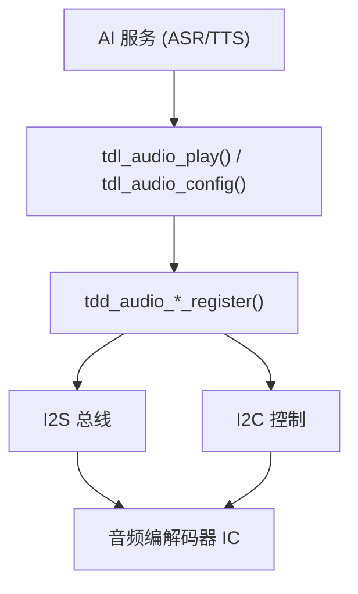

# 音频编解码器驱动指南

将音频编解码器集成到 TuyaOpen，用于语音交互、音频播放和 AI 应用。

## 音频架构

## 平台差异

| 方面 | T5AI | ESP32-S3 |
|------|------|----------|
| TDD 位置 | `src/peripherals/audio_codecs/tdd_audio/` | `boards/ESP32/common/audio/` |
| I2S 驱动 | TKL `tkl_i2s_*` | ESP-IDF `i2s_channel_*` |
| I2C 控制 | TKL `tkl_i2c_*` | ESP-IDF `i2c_master_*` |
| 编解码器库 | 内部 | `esp_codec_dev`（ESP-IDF 组件） |

## 可用的 ESP32 音频编解码器

| 编解码器 | 文件 | I2C 地址 | 说明 |
|---------|------|----------|------|
| ES8311 | `tdd_audio_8311_codec.c` | 0x18 | S3 开发板常用 |
| ES8388 | `tdd_audio_es8388_codec.c` | 0x20 | 备选 |
| ES8389 | `tdd_audio_es8389_codec.c` | 可变 | DNESP32S3-BOX2 |
| 无编解码器 | `tdd_audio_no_codec.c` | 无 | 直接 DAC 输出 |

## 编写新的编解码器 TDD

1. 创建 `tdd_audio_wm8960.c` 和 `.h`
2. 实现四个接口函数：`open`、`play`、`config`、`close`
3. 在 `open` 中初始化 I2C、I2S 和编解码器寄存器
4. 在 `play` 中将 PCM 数据写入 I2S 通道
5. 调用 `tdl_audio_driver_register()` 完成注册

## 参考资料

- [TDD/TDL 驱动架构](../driver-architecture)
- [音频驱动参考](../audio)
- [ESP32 支持功能](../../hardware-specific/espressif/esp32-supported-features)
