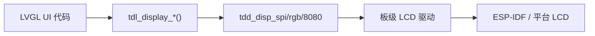

# 显示驱动集成指南

使用 TDL 显示框架和 LVGL 将新的显示面板集成到 TuyaOpen。

## 显示架构



| 平台 | LVGL 来源 | 显示端口 | BSP 位置 |
|------|----------|---------|----------|
| T5AI | TuyaOpen `src/liblvgl/` | `tdl_display` + `tdd_display` | `boards/T5AI/` |
| ESP32 | ESP-IDF LVGL 组件 | ESP-IDF `esp_lcd_*` | `boards/ESP32/common/display/` |

## 支持的面板接口

| 接口 | TDD 驱动 | 示例面板 |
|------|---------|---------|
| SPI | `tdd_disp_spi_device_register` | ST7789, ILI9341, GC9A01 |
| RGB（并行） | `tdd_disp_rgb_device_register` | 大尺寸 TFT |
| 8080（并行） | 板级 (`lcd_st7789_80.c`) | DNESP32S3-BOX 上的 ST7789 |
| QSPI | 板级 (`lcd_sh8601.c`) | SH8601 AMOLED |
| I2C | 板级 (`oled_ssd1306.c`) | SSD1306 OLED |

## Kconfig 要求

```kconfig
config ENABLE_ESP_DISPLAY
    bool
    default y
```

## 参考资料

- [TDD/TDL 驱动架构](../driver-architecture)
- [显示驱动参考](../display)
- [外设支持列表](../support_peripheral_list)
