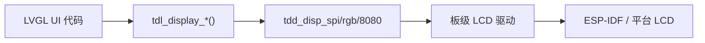

TuyaOpen 中的显示驱动将面板注册到 TDL 显示框架，使 LVGL 与应用可通过 `tdl_display_*` 向其绘制。本指南使用 TDL 显示与 LVGL 集成新的显示面板。

## 前置条件

- 阅读 [TDD/TDL 驱动架构](../driver-architecture)
- 完成 [环境搭建](../../quick-start/enviroment-setup)
- 带有初始化序列的显示面板数据手册

## 显示架构



TuyaOpen 的显示系统因平台而异，有两条路径：

| 平台 | LVGL 来源 | 显示端口 | BSP 位置 |
|------|----------|---------|----------|
| T5AI | TuyaOpen `src/liblvgl/` | `tdl_display` + `tdd_display` | `boards/T5AI/` |
| ESP32 | ESP-IDF LVGL 组件 | ESP-IDF `esp_lcd_*` | `boards/ESP32/common/display/` |

## 支持的面板接口

| 接口 | TDD 驱动 | 示例面板 |
|------|---------|---------|
| SPI | `tdd_disp_spi_device_register` | ST7789、ILI9341、GC9A01 |
| RGB（并行） | `tdd_disp_rgb_device_register` | 大尺寸 TFT 面板 |
| 8080（并行） | 板级 (`lcd_st7789_80.c`) | DNESP32S3-BOX 上的 ST7789 |
| QSPI | 板级 (`lcd_sh8601.c`) | SH8601 AMOLED |
| I2C | 板级 (`oled_ssd1306.c`) | SSD1306 OLED |

## 添加新的 SPI 显示屏（T5AI 示例）

### 1. 注册面板 TDD

```c
#include "tdd_disp_spi_device.h"

TDD_DISP_SPI_DEVICE_T panel_cfg = {
    .spi_cfg = {
        .port = TUYA_SPI_NUM_0,
        .mode = TUYA_SPI_MODE0,
        .speed = 40000000,
        .dc_pin = DC_PIN,
        .cs_pin = CS_PIN,
    },
    .dev_info = {
        .width = 240,
        .height = 320,
        .color_depth = 16,
    },
    .init_cmds = st7789_init_sequence,
    .init_cmds_len = sizeof(st7789_init_sequence),
};
tdd_disp_spi_device_register("main_display", &panel_cfg);
```

### 2. 在应用中创建显示

```c
TDL_DISP_HANDLE disp;
tdl_display_create("main_display", &disp);
tdl_display_open(disp);
```

### 3. 连接 LVGL

TDL 显示通过 `tdl_display_create` 期间注册的 flush 回调与 LVGL 集成。

## 在 ESP32 上添加显示屏

在 ESP32 上，显示屏直接使用 ESP-IDF 的 LCD 驱动（而非 TuyaOpen 的 `tdd_disp_*` 层）。每块开发板在 `boards/ESP32/{board}/` 中实现各自的 LCD 初始化：

- `lcd_st7789_spi.c`（SPI 面板）
- `lcd_st7789_80.c`（并行 8080）
- `lcd_sh8601.c`（QSPI AMOLED）
- `oled_ssd1306.c`（I2C OLED）

开发板的 `board_register_hardware()` 初始化显示屏，并将其接入 `boards/ESP32/common/display/lv_port_disp.c` 中的 ESP-IDF LVGL 移植层。

## Kconfig 要求

```kconfig
config ENABLE_ESP_DISPLAY
    bool
    default y

config DISPLAY_NAME
    string "display"
```

## 参考资料

- [LVGL 应用指南](lvgl-application-guide)
- [TDD/TDL 驱动架构](../driver-architecture)
- [显示驱动参考](../display)
- [外设支持列表](../support_peripheral_list)
